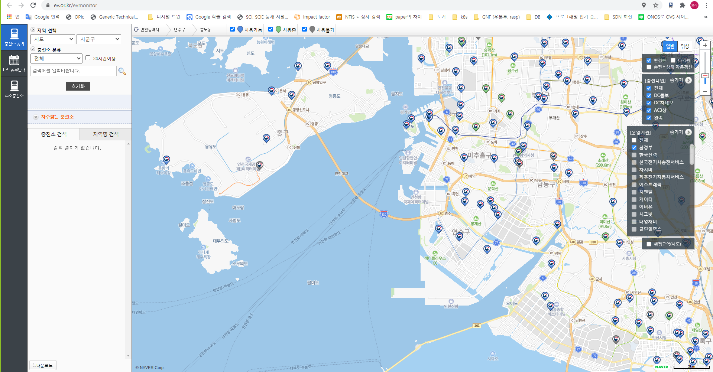
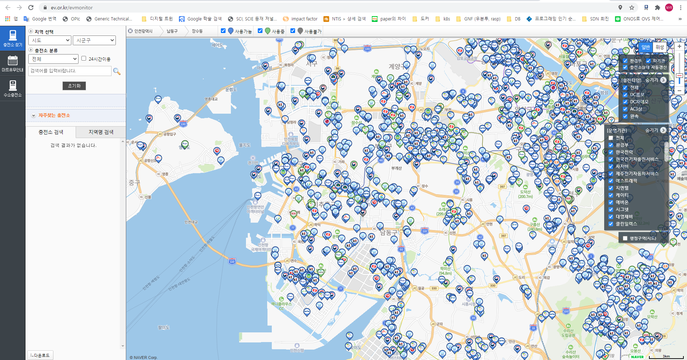

## 개발 프레임워크 설계

> - 요구사항
>
>   - 기능
>     - 전기차 충전소 위치찾기
>     - 네이버 사용자 인증
>     - DB연동
>     - GPS, 지도, CCTV 연동 등..
>   - 가격
>     - 무료
>   - 개발편의성
>     - python기반
>
> - 개발환경
>
>   - OS : CentOS v7.9.2009 
>   - git : https://github.com/hoon25/EV_Project
>   - 사용할 개발 프레임워크 : Django v.3.1.5
>   - 사용할 언어 : python v3.8.1
>   - 사용할 DB : mysql v8.0.23
>     - 데이터소스 구성 (김지윤)
>     - 트랜잭션 처리 설계
>     - DB쿼리만 기록 할지? 쿼리 결과까지 기록할지?
>
> - <u>**각 기능별 사용할 플랫폼**</u>
>
>   - 로그인 (서은상)
>     - 사이트 내 로그인/회원가입
>     - 네이버 로그인
>   - DB (김지윤)
>   - 오픈 API연동 (정은경)
>   - API 활용하여 전기차 중전소 연동 (서은상)
>   - GPS 기반 가까운 충전소 찾기 (정은경)
>   - API 활용하여 지도 연동 (최창훈) 
>   - API 활용하여 CCTV 연동 (김지윤) 
>   - 별점 및 리뷰 (최창훈)
>   - 충전소 근처 음식점/놀거리 컨텐츠 추천 (김보라)
>   - 충전소 대기자 조회 (김보라)
>   - 충전소 예약 서비스 (정은경)
>   - 충전소 사용 혼잡도 (김지윤)
>
> - 로그 설계 
>
>   - 로그 포맷 
>
>   - 로그 어떻게 분리할지 
>
>     - timing : 기능 개발시 로깅도
>
>     - purpose : 기능의 목표에 맞춰서 가설확인, 지표측정
>
>     - attribute : 필요한 항목을 정함
>
>       예시1) 개인을 식별할 수 있는 정보 : 가입전-후 / 로그인 전-후
>
>       예시2) 정책 변경에 따라 개인 식별 정보가 바뀔 수 있음에 대비 : ISMS 인증을 위한 개인 정보보호 적용, 탈퇴자 처리 정책 변경
>
>       예시3) 식별 목적 외에도 segmentation 성격의 정보가 추가로 필요 : 차종에 따른 충전기 커넥터 정보 (분석 편의를 위한 경우)
>
>       예시4) 시간
>
>       예시5) 페이지 영역별 naming (이전 영역 정보가 필요할 수 있으므로)
>
>     - sample : 원하는 output을 시나리오별로 작성
>
>   - 로그 주기
>
>     - 얼마나 자주 남길것인지? (대상 이벤트 수준을 잘 정의해야 함)
>     - 얼마나 자세히 남길 것인지?
>     - DB정보를 통해 join으로 확인할 수 있는 정보는 가급적 제외
>
> - 비교 사이트 
>
>   - https://www.ev.or.kr/evmonitor
>
>     
>
>     